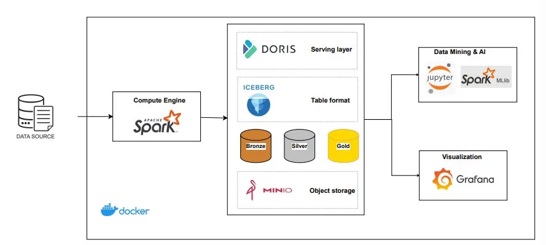

# 🌦️ CO4033 — Weather Forecast & Extreme Event Detection

> **Mục tiêu:** Xây dựng pipeline Big Data end-to-end để thu thập, xử lý, lưu trữ dữ liệu thời tiết và huấn luyện mô hình dự báo lượng mưa và phát hiện thời tiết cực đoan (nắng nóng).

---

## 📐 Kiến trúc hệ thống


Pipeline xử lý dữ liệu theo mô hình **Medallion Architecture** gồm 3 tầng:

| Tầng | Mô tả |
|------|-------|
| **Bronze** | Dữ liệu thô từ nguồn, lưu dạng Parquet trên MinIO (`s3a://iceberg/bronze/`) |
| **Silver** | Dữ liệu đã được làm sạch & chuẩn hóa, lưu dạng Iceberg table |
| **Gold** | Dữ liệu đã tổng hợp, sẵn sàng cho phân tích và huấn luyện mô hình |

---

## 🛠️ Tech Stack

| Thành phần | Công nghệ | Vai trò |
|---|---|---|
| **Compute Engine** | Apache Spark 3.x | Xử lý dữ liệu phân tán (ETL, transformation) |
| **Table Format** | Apache Iceberg 1.9.2 | Quản lý schema, time-travel, ACID trên Data Lake |
| **Object Storage** | MinIO | S3-compatible storage, lưu trữ dữ liệu Bronze/Silver/Gold |
| **Serving Layer** | Apache Doris 3.1.3 | OLAP database phục vụ truy vấn nhanh |
| **Notebook** | JupyterLab | Phân tích dữ liệu, huấn luyện mô hình ML |
| **ML Framework** | Spark MLlib / scikit-learn, XGBoost | Dự báo mưa & phát hiện thời tiết cực đoan |
| **Visualization** | Grafana | Dashboard theo dõi và trực quan hoá dữ liệu |
| **Containerization** | Docker + Docker Compose | Đóng gói và triển khai toàn bộ hệ thống |
| **UI App** | Streamlit | Giao diện dự báo thời tiết tương tác |

---

## 📁 Cấu trúc thư mục

```
CO4033-Weather-forecast/
├── config/
│   └── spark/              # Cấu hình Spark (spark-defaults.conf, ...)
├── docker/
│   └── spark/              # Dockerfile tuỳ chỉnh cho Spark
├── docs/                   # Tài liệu bổ sung
├── model/                  # Model đã huấn luyện (pickle / joblib)
├── notebook/               # Jupyter Notebooks (EDA, training, ...)
├── output/                 # Kết quả đầu ra (charts, reports, ...)
├── scripts/                # PySpark scripts (bronze.py, silver.py, ...)
├── src/                    # Source code chính (dùng trong Jupyter container)
├── app.py                  # Streamlit app – giao diện dự báo thời tiết
├── utils.py                # Hàm tiện ích (load model, build input frame, CSS)
├── docker-compose.yml      # Khởi động toàn bộ hệ thống
├── requirements.txt        # Python dependencies
└── .env                    # Biến môi trường (API key, credentials, ...)
```

---

## ⚙️ Yêu cầu hệ thống

- **Docker** ≥ 24.x
- **Docker Compose** ≥ 2.x
- RAM: tối thiểu **8 GB** (khuyến nghị 16 GB)
- Disk: tối thiểu **10 GB** trống

---

## 🚀 Hướng dẫn chạy

### 1. Clone repository

```bash
git clone https://github.com/itzKieuMinh05/CO4033-Weather-forecast.git
cd CO4033-Weather-forecast
```

### 2. Cấu hình biến môi trường (tuỳ chọn)

File `.env` đã có sẵn với thông tin mặc định. Có thể chỉnh sửa nếu cần:

```bash
cp .env .env.local   # Backup nếu muốn
```

### 3. Khởi động toàn bộ hệ thống

```bash
docker compose up -d --build
```

Hoặc chỉ khởi động các service cốt lõi (không Doris):

```bash
docker compose up -d --build spark-master spark-worker spark-notebook minio iceberg-rest
```

### 4. Chạy pipeline dữ liệu

**Bước 1 – Bronze layer** (ingest dữ liệu thô → Parquet):
```bash
docker compose exec spark-master spark-submit \
  --master spark://spark-master:7077 \
  /opt/spark/scripts/bronze.py
```

**Bước 2 – Silver layer** (Parquet → Iceberg table đã làm sạch):
```bash
docker compose exec spark-master spark-submit \
  --master spark://spark-master:7077 \
  /opt/spark/scripts/silver.py
```

### 5. Huấn luyện mô hình ML

Mở JupyterLab tại [http://localhost:8888](http://localhost:8888) (không cần token), sau đó chạy các notebook trong thư mục `src/` hoặc `notebook/`.

### 6. Chạy Streamlit App (giao diện dự báo)

```bash
pip install streamlit scikit-learn xgboost
streamlit run app.py
```

---

## 🌐 Truy cập các dịch vụ

| Dịch vụ | URL | Thông tin đăng nhập |
|---|---|---|
| Spark Master UI | http://localhost:8080 | — |
| Spark Worker UI | http://localhost:8081 | — |
| MinIO Console | http://localhost:9002 | `minioadmin` / `minioadmin123` |
| Iceberg REST Catalog | http://localhost:8181 | — |
| JupyterLab | http://localhost:8888 | Không cần token |
| Apache Doris FE | http://localhost:8030 | — |
| Grafana | http://localhost:3000 | `admin` / `admin` |

---

## 🤖 Mô hình Machine Learning

Hệ thống huấn luyện **2 mô hình phân loại** độc lập:

| Mô hình | Nhiệm vụ | Thuật toán |
|---|---|---|
| `extreme_model` | Phân loại thời tiết cực đoan (nắng nóng, bình thường, ...) | Random Forest / XGBoost |
| `rain_model` | Dự báo có mưa hay không (binary classification) | Random Forest / XGBoost |

**Đặc trưng đầu vào chính:**
- Nhiệt độ (°C), Độ ẩm (%), Áp suất (hPa), Mây che phủ (%)
- Tầm nhìn, Hướng gió, Giờ, Ngày, Tháng, Thứ trong tuần
- Giá trị lag-1 của nhiệt độ, độ ẩm, áp suất

Mô hình đã huấn luyện được lưu trong thư mục `model/` và được nạp tự động bởi `app.py`.

---

## 🧪 Kiểm tra nhanh

```bash
# Kiểm tra Iceberg với Spark
docker compose exec spark-master spark-submit \
  --master spark://spark-master:7077 \
  /opt/spark/scripts/spark_sample.py

# Xem log Spark Master
docker logs forecasting-spark-master

# Xem log MinIO
docker logs forecasting-minio
```

---

## 📦 Python Dependencies chính

```
pyspark
pandas==3.0.0
numpy==2.4.1
scikit-learn
xgboost
streamlit
matplotlib==3.10.8
seaborn==0.13.2
scipy==1.15.3
kagglehub==0.4.1
```

---

## 📝 Ghi chú

- Dữ liệu thời tiết được thu thập qua **Kaggle API** (`kagglehub`). Đảm bảo cấu hình `KAGGLE_USERNAME` và `KAGGLE_KEY` trong `.env` trước khi chạy Bronze layer.
- Spark Worker được cấu hình với **4 GB RAM** và **2 cores**. Điều chỉnh `SPARK_WORKER_MEMORY` và `SPARK_WORKER_CORES` trong `docker-compose.yml` nếu cần.
- Toàn bộ dữ liệu của MinIO và Doris được persist qua Docker volumes (`minio_data`, `doris_fe_data`, `doris_be_data`).
- Để dừng hệ thống: `docker compose down` — thêm `-v` để xóa cả volumes.

---
